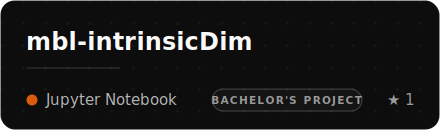

 

I started out poking at phase transitions and gravitational constants, decided the universe was complicated enough, 
and now I mostly teach machines to be useful: AI agents, motion-generating diffusion models, 
and generative art that's really just math caught in the act.

 

---

---

### ◆ Stuff I've made

*A loosely-sorted museum of curiosity. Some are serious. Some started as "I wonder if...".*

<table border="0">
<tr>
<td width="50%" valign="top">

> An **agentic second brain** — a fork-it starter kit (file format + MCP server + web UI + agent skills) that gives Claude Code & Cursor durable, local-first memory they can read and reason over.

</td>
<td width="50%" valign="top">

> **Computational physics you can touch** — 190+ interactive simulations across 10 topics. Examples: Ising model, Mandelbrot explorer, Abelian sandpile, Lorenz attractor, percolation, Vicsek flocking.

</td>
</tr>
<tr>
<td width="50%" valign="top">

> **Master's project** — text-to-3D-motion via latent diffusion. A transformer VAE compresses motion clips to a compact latent; a CLIP-conditioned diffusion model generates sequences from text prompts.

</td>
<td width="50%" valign="top">

> **Bachelor's project** — using *intrinsic dimension* to detect the many-body-localization phase transition. As disorder grows, quantum states collapse onto a lower-dimensional manifold; a neighbour-graph estimator (2NN) plus scaling collapse pins down the critical point.

</td>
</tr>
</table>

...and a long tail of physics notebooks, sea-level models & crossword solvers → <a href="https://github.com/tonton-golio?tab=repositories">all repos</a>

---

 

<!-- contribution snake — generated by .github/workflows/snake.yml, served from the output branch -->
<picture>
  <source media="(prefers-color-scheme: dark)" srcset="https://raw.githubusercontent.com/tonton-golio/tonton-golio/output/github-snake-dark.svg" />
  <source media="(prefers-color-scheme: light)" srcset="https://raw.githubusercontent.com/tonton-golio/tonton-golio/output/github-snake.svg" />
  
</picture>

 

<code>physicist → coder · still mostly just curious</code>

