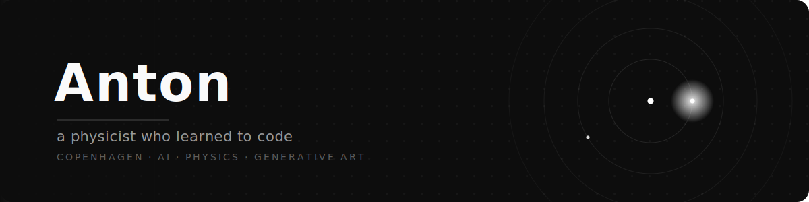
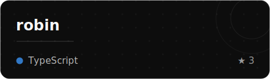
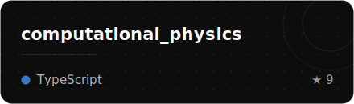
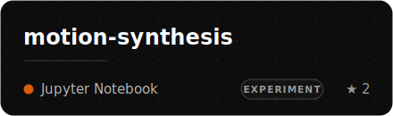
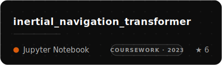
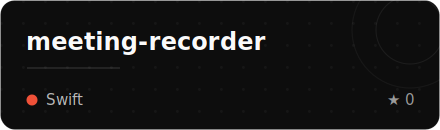
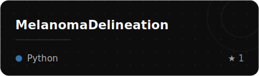

 

I started out poking at phase transitions and gravitational constants, decided the universe was complicated enough, 
and now I mostly teach machines to be useful: AI agents, motion-generating diffusion models, 
and generative art that's really just math caught in the act.

 

---

---

### ◆ Stuff I've made

*A loosely-sorted museum of curiosity. Some are serious. Some started as "I wonder if...".*

<table border="0">
<tr>
<td width="50%" valign="top">

> An **agentic second brain** — a fork-it starter kit (file format + MCP server + web UI + agent skills) that gives Claude Code & Cursor durable, local-first memory they can read and reason over. The thing I nerd out about most.

</td>
<td width="50%" valign="top">

> **Computational physics you can touch** — 190+ interactive simulations across 10 topics, where every equation runs and every model is yours to break. My most-starred experiment; turns out others are curious too.

</td>
</tr>
<tr>
<td width="50%" valign="top">

> Teaching an AI **to move** with latent diffusion + a VAE — basically running entropy backwards until something dances. A stalled-but-loved experiment.

</td>
<td width="50%" valign="top">

> Figuring out **where you are** from raw IMU sensors when GPS won't help — pitting Transformers, LSTMs & GRUs against classical strapdown navigation. Attention, it turns out, also has opinions about dead-reckoning.

</td>
</tr>
<tr>
<td width="50%" valign="top">

> A native **macOS menu-bar app** that records meetings and transcribes them fully on-device (WhisperKit) — it even tells speakers apart. Built because I wanted meeting notes without shipping audio to the cloud.

</td>
<td width="50%" valign="top">

> **Drawing the line on melanoma** — segmenting tumours from photoacoustic imaging (a 1-D CNN per pixel, then an active contour to smooth the edge) and measuring their thickness. Biomedical imaging, quantified.

</td>
</tr>
</table>

...and a long tail of physics notebooks, sea-level models & crossword solvers → <a href="https://github.com/tonton-golio?tab=repositories">all repos</a>

---

 

<!-- contribution snake — generated by .github/workflows/snake.yml, served from the output branch -->
<picture>
  <source media="(prefers-color-scheme: dark)" srcset="https://raw.githubusercontent.com/tonton-golio/tonton-golio/output/github-snake-dark.svg" />
  <source media="(prefers-color-scheme: light)" srcset="https://raw.githubusercontent.com/tonton-golio/tonton-golio/output/github-snake.svg" />
  
</picture>

 

<code>physicist → coder · still mostly just curious</code>

